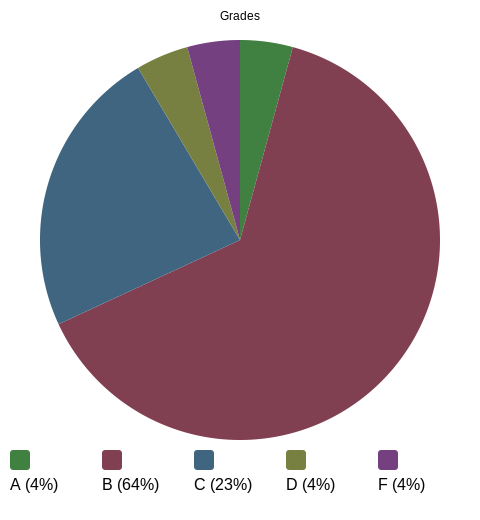

# Pie Chart

This is a simple pie chart generator.  You provide a [JSON5](https://json5.org) file with data it generates an SVG file. You can convert the SVG to PNG or other bitmap formats with the [resvg](https://crates.io/crates/resvg) tool.

Here is an example of the output:

Install with `cargo install pie_chart`.  Run with `pie-chart`.

Features of the tool include:

- Automatic generation of the pie chart legend
- Automatic color selection to maximize contrast between wedges
- Uses SVG styles to allow for the image to be easily modified
